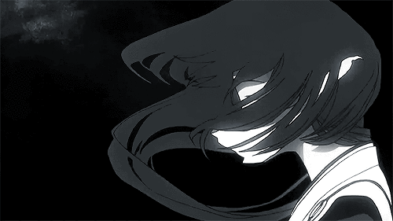

  

  

 

  

 
  <picture>
    <source media="(prefers-color-scheme: dark)" srcset="https://raw.githubusercontent.com/otsolain/otsolain/output/pacman-contribution-graph-dark.svg" />
    <source media="(prefers-color-scheme: light)" srcset="https://raw.githubusercontent.com/otsolain/otsolain/output/pacman-contribution-graph-dark.svg" />
    
  </picture>

